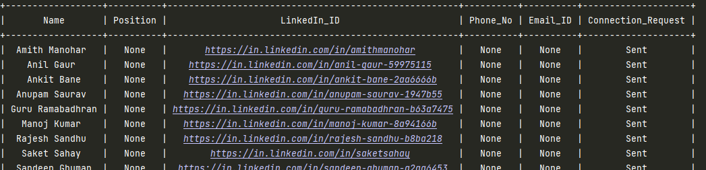

# LinkedIN Auto Connection Bot
This project is a LinkedIn auto connection bot which automates the process of finding and connecting with professionals
of an industry of your requirement.

## Description
The bot performs the following tasks:
1. **Scrapes** marketing LinkedIn profiles from Chrome using **BeautifulSoup**.
2. Stores the scraped profile links in a CSV file.
3. Uses **Selenium** to log into LinkedIn on Chrome.
4. Iterates over the links in the CSV file sending connection request to each of them along-with extracting their name.
5. Updates the Connection details into a **MySQL** database using **mysql-connector-python**.

## Motivation
I am a **Marketing Executive** for North-East India's largest annual techno-management fest **Techniche** conducted solely by the student body of **Indian Institute of Technology Guwahati**.
As a fresher in Techniche one of my first tasks was to conduct profiling and listing of various companies from a particular sector that could be our potential financial partners for the event.

This involved hours of scouring through LinkedIn and sending connection requests to marketing personnel of targeted companies. During this tedious and mundane journey of profiling, I decided to automate the process using 
web scraping, web automation and database management to aid me in my pursuit.

I used DBMS instead of excel sheets to create a concrete database of profiles that can be used by upcoming freshers as well and also to keep a centralized directory for storing relevant profiles for utilizing in other Institute events too.
## Prerequisites

Before you begin, ensure you have met the following requirements:
- Python 3.7 or higher
- Google Chrome
- ChromeDriver
- LinkedIn account
- MySQL server

## Installation
1. Clone the Repository:
```bash
git clone https://github.com/NemesisXVI/linkedin-auto-connect-bot.git
cd linkedin-auto-connect-bot
```
2. Install required Packages:
```bash
pip install -r requirements.txt
```
3. Install ChromeDriver for Selenium:

ChromeDriver : https://sites.google.com/chromium.org/driver/

Documentation: https://selenium-python.readthedocs.io/installation.html#drivers

## Usage:
### 1. Update your information in config.ini :
```python
[LinkedIn Credentials]
LINKEDIN_USERNAME = your_linkedin_email
LINKEDIN_PASSWORD = your_linkedin_password

[MySQL Credentials]
MYSQL_HOST = localhost
MYSQL_USER = your_mysql_username
MYSQL_PASSWORD = your_mysql_password
MYSQL_DATABASE = your_mysql_password

[SECTOR]
SECTOR = music

[CSV Handling]
NAME_CSV_to_store = csv_name.csv
NAME_CSV_to_use = csv_name.csv
```
### 2. Create a Table in database:

Run  **'Database_Handling.py'**  to create a table named profile in your database. The file will also describe the table and show its contents.
```python
python Database_Handling.py
```
Once this is complete, open the file and comment out line 51 in the main function, to avoid reconstruction of the table.
```python
if __name__=="__main__":
    db_obj = DataBase()
    #db_obj.Create_Table()
    db_obj.Describe(describe=True)
    db_obj.Show_Content()
```
Now Database_Handling.py can be used to describe and show the content of the table profile.

### 3. Scrape LinkedIn Profiles:

Run **'Get_Profiles.py'** to scrape marketing profiles and store them in a CSV file in the same directory.
```python
python Get_Profiles.py
```
**For eg:** Look at the files search_results2.csv and search_results_music.csv to see LinkedIn Ids of marketing professionals in sports and music industry respectively.

### 4. Send Connection Requests:

Run the **'Linkedin.py'** to log into linkedin,send connection requests and update the MySQL database.
```python
python Linkedin.py
```
This is what the final table will look like:


If for any reason connection request was not sent to the professional, the code will not break,
it will give a message "Failed to Connect" and update the **'Connection_request'** column of the database
to **'Not sent'**.

### 5. Further Steps:
Actively check your LinkedIn Connections. If any of these professionals accept your connection request, using the contact info
option obtain their phone_no. and email ids and update them in your database correspondingly along with their position (Company Name and post)
Once you feel like you have a robust database, group the database according to company name and start your cold callings.

**Enjoy!!**

## Support
For any queries related to the bot, contact me through my socials.

